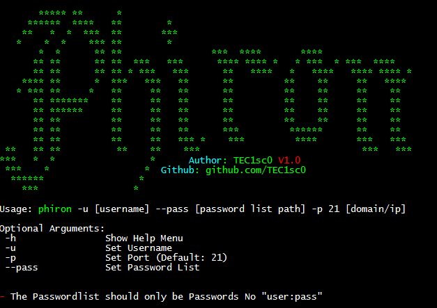

# **Phiron**
---

   

## A Cracking Tool To Crack FTP Service's **The Responsibility Lies With The Person Himself**
---
# Usage:
- `python3 phiron -u [username] --pass [password list path] -p 21 [domain/ip]`
#### For Example: 
- `python3 phiron.py -u admin -p 21 --pass pass.txt 1.2.3.4`
### Tested On Real Servers. `Python 3.9.1`
### **Use It In The Right Way.**
